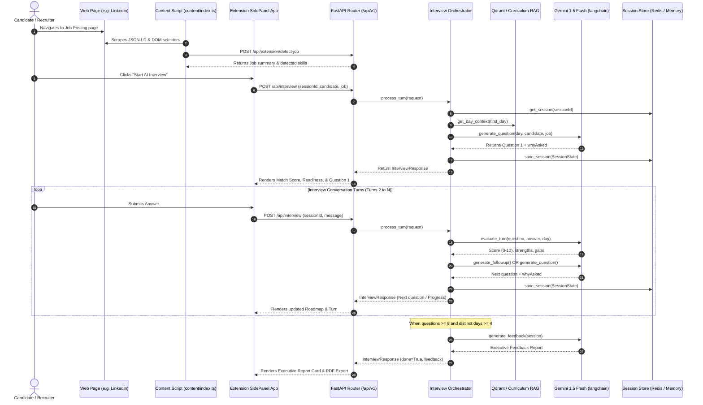

# 🚀 InterviewOS — Developer Architecture, API Flow & Onboarding Guide

Welcome to **InterviewOS**! This handbook is specifically crafted for developers joining the project. It provides an exhaustive breakdown of the platform's features, architecture (from DOM/API ingestion down to session storage and RAG retrieval), known code bugs/pitfalls, and key architectural suggestions for upcoming iterations.

---

## 📑 Table of Contents
1. [Project Overview & Core Mission](#1-project-overview--core-mission)
2. [Technology Stack](#2-technology-stack)
3. [Repository Directory Structure](#3-repository-directory-structure)
4. [End-to-End API Flow & Data Processes](#4-end-to-end-api-flow--data-processes)
5. [Complete Feature Catalog](#5-complete-feature-catalog)
6. [Session Storage & Database Architecture](#6-session-storage--database-architecture)
7. [Known Bugs, Edge Cases & Code Errors](#7-known-bugs-edge-cases--code-errors)
8. [Architectural Suggestions & Feature Roadmap](#8-architectural-suggestions--feature-roadmap)

---

## 🎯 1. Project Overview & Core Mission

**InterviewOS** is an **Enterprise AI Interview Intelligence Platform**. Built as a Manifest V3 Chrome Extension paired with a high-throughput Python FastAPI backend, it provides real-time job context scraping, adaptive technical interviewing, explainable AI rationales, and executive evaluation reporting.

### Core Mission & Key Use Cases:
1. **Automated Job Detection**: Scrapes and parses target job postings (LinkedIn, Greenhouse, Lever, etc.) in real time when a candidate navigates job boards.
2. **Context-Aware Adaptive Interviewing**: Synthesizes job skill requirements with candidate profile signals to dynamically plan a technical interview curriculum.
3. **Explainable AI (XAI)**: Displays multi-stage AI reasoning animations and "Why Was This Question Generated?" accordions on every turn.
4. **"Mic Drop" Executive Outcome Reporting**: Evaluates technical depth, scoring candidates on a 0–100 scale, generating strengths/weaknesses matrices, PDF reports, and one-click recruiter summaries.

---

## 🛠️ 2. Technology Stack

### Backend Stack (`/backend`)
- **Framework**: Python 3.13 + FastAPI + Pydantic v2 ([main.py](file:///d:/Ai%20Interview%20Ext/backend/app/main.py))
- **LLM Orchestration**: Google Gemini 1.5 Flash (`langchain-google-genai`) with OpenAI (`gpt-4o-mini`) fallback support via unified factory [`get_llm()`](file:///d:/Ai%20Interview%20Ext/backend/app/utils/llm.py#L8-L40).
- **RAG & Vector Search**: Qdrant (`:memory:` vector store) with JSON curriculum embeddings in [`CurriculumRetriever`](file:///d:/Ai%20Interview%20Ext/backend/app/rag/retriever.py#L6-L62).
- **Session Storage**: Dual-tier [`SessionService`](file:///d:/Ai%20Interview%20Ext/backend/app/services/session_service.py#L10-L75) (Redis via `redis.asyncio` with automatic in-memory dict fallback).
- **Environment Management**: `python-dotenv` loading [`backend/.env`](file:///d:/Ai%20Interview%20Ext/backend/.env).
- **Testing**: Pytest + FastAPI TestClient ([`backend/tests/`](file:///d:/Ai%20Interview%20Ext/backend/tests)).

### Frontend Stack (`/frontend`)
- **Platform**: Chrome Extension Manifest V3 (SidePanel API + Content Scripts + Service Worker).
- **UI Framework**: React 18 + TypeScript 5 + Tailwind CSS v3 + Lucide Icons.
- **State Management**: Reactive custom Store subscriber pattern in [`interviewStore`](file:///d:/Ai%20Interview%20Ext/frontend/src/store/interview.store.ts#L87-L224).
- **Export Utilities**: Custom PDF printer & Clipboard summary generator in [`reportExporter.ts`](file:///d:/Ai%20Interview%20Ext/frontend/src/lib/reportExporter.ts).
- **Build System**: Vite 6 + PostCSS.

---

## 📁 3. Repository Directory Structure

```
d:\Ai Interview Ext\
├── DEVELOPER_GUIDE.md               <-- Complete Developer Architecture & Onboarding Manual
├── package.json                     <-- Monorepo script runner
│
├── backend/
│   ├── .env                         <-- Environment variables (GEMINI_API_KEY, REDIS_URL)
│   ├── app/
│   │   ├── main.py                  <-- FastAPI app entry point & router definitions
│   │   ├── api/v1/endpoints/
│   │   │   ├── interview.py         <-- POST /api/interview endpoint handler
│   │   │   └── extension.py         <-- Chrome extension helper endpoints (/detect-job, /start-job-interview)
│   │   ├── agents/                  <-- AI Reasoning Engines
│   │   │   ├── orchestrator.py      <-- Interview state machine & turn process execution
│   │   │   ├── question_generator.py<-- Curriculum RAG question generator agent
│   │   │   ├── followup_generator.py<-- Follow-up question generator agent
│   │   │   ├── evaluator.py         <-- Technical depth & gap scoring evaluator
│   │   │   └── feedback_generator.py<-- Executive summary & report synthesis engine
│   │   ├── config/
│   │   │   └── settings.py          <-- Dataclass environment configuration
│   │   ├── models/
│   │   │   └── session.py           <-- SessionState & TurnEvaluation data models
│   │   ├── schemas/
│   │   │   ├── interview.py         <-- Pydantic API payload & response schema definitions
│   │   │   └── extension.py         <-- Extension endpoint request/response contracts
│   │   ├── services/
│   │   │   ├── session_service.py   <-- Redis + memory session store service
│   │   │   ├── job_analyzer.py      <-- Skill extraction service
│   │   │   ├── candidate_analyzer.py<-- Curriculum planner service
│   │   │   └── curriculum_service.py<-- RAG curriculum loader
│   │   └── data/                    <-- JSON datasets (candidates.json, curriculum.json)
│   ├── tests/                       <-- Pytest suite
│   └── requirements.txt
│
└── frontend/
    ├── src/
    │   ├── sidepanel/
    │   │   └── SidePanelApp.tsx     <-- Main Extension Copilot UI
    │   ├── components/widget/
    │   │   └── FloatingWidget.tsx   <-- Injected job notification widget
    │   ├── content/
    │   │   └── index.ts             <-- DOM & JSON-LD JobPosting parser content script
    │   ├── store/
    │   │   └── interview.store.ts   <-- Reactive state store (Match, Readiness, Roadmap, Thinking)
    │   ├── api/
    │   │   └── interview.ts         <-- Axios API client layer with fallback support
    │   ├── lib/
    │   │   └── reportExporter.ts    <-- PDF printer & Clipboard copy helpers
    │   └── types/
    │       └── feedback.ts          <-- TypeScript type definitions
    ├── manifest.json                <-- Manifest V3 extension configuration
    └── package.json
```

---

## 🔄 4. End-to-End API Flow & Data Processes

### 4.1 Visual Architectural Sequence Flow



### 4.2 Detailed API Endpoint Contracts

1. **`GET /api/extension/status`** ([extension.py#L16-L21](file:///d:/Ai%20Interview%20Ext/backend/app/api/v1/endpoints/extension.py#L16-L21)):
   - **Purpose**: Health check & capability discovery for the extension.
   - **Response**: `{ "status": "ok", "version": "1.0.0", "enabled": true, "supportedPortals": ["linkedin.com", "greenhouse.io", "lever.co", ...] }`

2. **`POST /api/extension/detect-job`** ([extension.py#L24-L37](file:///d:/Ai%20Interview%20Ext/backend/app/api/v1/endpoints/extension.py#L24-L37)):
   - **Purpose**: Accepts extracted page metadata and determines whether it represents an active job posting.
   - **Request Payload**:
     ```json
     {
       "url": "https://www.linkedin.com/jobs/view/123456",
       "domain": "linkedin.com",
       "jobTitle": "Senior AI Engineer",
       "company": "TechCorp",
       "rawDescription": "We are looking for..."
     }
     ```
   - **Response Payload**: Returns `JobDetectionResponse` containing `isJobProfile`, parsed `JobAnalysisSummary`, and prompt trigger for extension UI.

3. **`POST /api/interview`** ([interview.py#L8-L21](file:///d:/Ai%20Interview%20Ext/backend/app/api/v1/endpoints/interview.py#L8-L21)):
   - **Purpose**: Primary stateful endpoint for interview initialization and turn processing.
   - **Session Initialization Payload**:
     ```json
     {
       "sessionId": "session_1723000000",
       "candidate": { "member": { "id": "cand_01", "name": "Alex Johnson", "jobRole": "AI Engineer" } },
       "job": { "jobTitle": "AI Engineer", "company": "OpenAI", "skills": ["FastAPI", "Docker", "LangGraph", "Redis"] }
     }
     ```
   - **Conversation Turn Response Payload**:
     ```json
     {
       "sessionId": "session_1723000000",
       "message": "Async endpoints in FastAPI run on an asyncio event loop..."
     }
     ```
   - **Response Payload (`InterviewResponse`)**:
     - `reply`: Interviewer response/question text.
     - `done`: Boolean flag indicating interview completion.
     - `whyAsked`: Multi-bullet explainability string explaining LLM reasoning.
     - `matchScore`: Numerical match score (0–100).
     - `readinessScore`: Numerical readiness score (0–100).
     - `requiredSkills`: Array of required job skills.
     - `candidateSkills`: Array of verified candidate skills.
     - `missingSkills`: Array of missing candidate skills.
     - `progress`: Object tracking question count, topics covered, remaining topics, and roadmap array.
     - `feedback`: Executive report object (populated when `done: true`).

---

## ⚡ 5. Complete Feature Catalog

1. **Automatic Job Context Extraction**: Uses a 3-tier extraction hierarchy in content scripts ([`content/index.ts#L45-L101`](file:///d:/Ai%20Interview%20Ext/frontend/src/content/index.ts#L45-L101)):
   - *Tier 1*: Schema.org `JobPosting` JSON-LD parsing (`<script type="application/ld+json">`).
   - *Tier 2*: Specialized portal DOM selectors (`.jobs-unified-top-card__job-title`, `h1.app-title`).
   - *Tier 3*: OpenGraph Meta Tags (`og:site_name`, `document.title`).
2. **Job Match Score Card (92%)**: Live compatibility badge calculated from skill overlap between job posting specifications and candidate proficiencies.
3. **Skill Gap Analysis Matrix**: Visual grid comparing `Required Skills`, `Your Skills`, and `Missing Skills`.
4. **Interview Readiness Metric (88%)**: Dynamic readiness score calculated during curriculum execution.
5. **Stage-by-Stage AI Thinking Timeline**: Animated progress lifecycle card during AI turn generation ([`interview.store.ts#L79-L85`](file:///d:/Ai%20Interview%20Ext/frontend/src/store/interview.store.ts#L79-L85)):
   - *Stage 1*: Reading Job Description
   - *Stage 2*: Retrieving Curriculum RAG
   - *Stage 3*: Evaluating Previous Answer
   - *Stage 4*: Planning Next Question
   - *Stage 5*: Generating Interview Question
6. **Explainability Accordion ("Why Was This Question Generated?")**: Transparent rationale bullet list provided below every interviewer turn.
7. **Live Interview Topic Roadmap**: Visual stepper tracking candidate progression across curriculum days (`FastAPI` ➔ `LangGraph` ➔ `RAG` ➔ `Docker` ➔ `Redis`).
8. **"Mic Drop" Executive Report Card**: Synthesized report containing 0–100 numerical scores, hiring recommendation (`Strong Hire`), top strength, biggest weakness, and next recommended learning topic.
9. **Export Engine**:
   - `Download PDF`: Custom styled printable report via [`reportExporter.ts`](file:///d:/Ai%20Interview%20Ext/frontend/src/lib/reportExporter.ts).
   - `Copy Recruiter Summary`: One-click copy formatted executive summary text for recruiting channels.

---

## 💾 6. Session Storage & Database Architecture

### 6.1 Data Models (`SessionState`)
Defined in [`app/models/session.py`](file:///d:/Ai%20Interview%20Ext/backend/app/models/session.py#L22-L35):
- `session_id`: Unique string identifying the active candidate interview session.
- `candidate`: `CandidateProfile` object containing member info, past missions, and skill signals.
- `job`: `JobDetails` object containing job title, company, skills, and raw description.
- `job_summary`: `JobAnalysisSummary` containing company, role, difficulty, duration.
- `current_question`: String containing the active question asked to the candidate.
- `current_day`: Integer curriculum day currently being evaluated.
- `questions_asked`: Counter tracking total turns elapsed.
- `days_covered`: List of curriculum days covered so far.
- `planned_days`: Ordered array of curriculum days planned for this candidate.
- `evaluations`: List of [`TurnEvaluation`](file:///d:/Ai%20Interview%20Ext/backend/app/models/session.py#L7-L19) objects (score, feedback, key_strengths, identified_gaps).
- `conversation_history`: List of role/content message dicts.
- `done`: Boolean flag indicating session completion status.
- `feedback`: [`FeedbackSchema`](file:///d:/Ai%20Interview%20Ext/backend/app/schemas/interview.py#L38-L59) executive report object.

### 6.2 Dual-Tier Storage Layer (`SessionService`)
Defined in [`app/services/session_service.py`](file:///d:/Ai%20Interview%20Ext/backend/app/services/session_service.py#L10-L75):
1. **Primary Redis Storage**: Connects using `redis.asyncio` via `REDIS_URL`. Serializes `SessionState` to JSON with 24-hour expiration (`setex(f"interview_session:{id}", 86400, json)`).
2. **In-Memory Storage Fallback**: An in-memory dict `self._memory_sessions` acts as an automatic fail-safe fallback if Redis is offline or unreachable.

### 6.3 Curriculum Vector Storage & RAG (`CurriculumRetriever`)
Defined in [`app/rag/retriever.py`](file:///d:/Ai%20Interview%20Ext/backend/app/rag/retriever.py#L6-L62):
- Loads curriculum days from [`curriculum.json`](file:///d:/Ai%20Interview%20Ext/backend/app/data/curriculum.json).
- Indexes title, day type, tech stack, and content chunks into memory.
- Provides day-context retrieval ([`get_day_context()`](file:///d:/Ai%20Interview%20Ext/backend/app/rag/retriever.py#L33-L45)) and keyword similarity search ([`search_relevant_context()`](file:///d:/Ai%20Interview%20Ext/backend/app/rag/retriever.py#L47-L59)).

---

## ⚠️ 7. Known Bugs, Edge Cases & Code Errors

As a developer working on this codebase, take note of the following active bugs and technical gotchas:

### 🐛 Bug 1: Hardcoded Candidate Skills in Orchestrator Skill Matrix
- **Location**: [`app/agents/orchestrator.py#L58-L65`](file:///d:/Ai%20Interview%20Ext/backend/app/agents/orchestrator.py#L58-L65)
- **Code Snippet**:
  ```python
  def _compute_skill_analysis(self, session: SessionState):
      req_skills = session.job.skills if session.job and session.job.skills else ["FastAPI", "Docker", "LangGraph", "Redis"]
      cand_skills = ["FastAPI", "LangGraph", "Python", "React", "TypeScript"] # <-- HARDCODED
  ```
- **Issue**: Candidate skills are hardcoded rather than extracted from `session.candidate.keySkills` or parsed resume signals.
- **Impact**: The UI Skill Gap matrix always displays identical candidate skills regardless of who is interviewing.

### 🐛 Bug 2: Static Match & Readiness Scores in Intermediate Turn Responses
- **Location**: [`app/agents/orchestrator.py#L149-L150`](file:///d:/Ai%20Interview%20Ext/backend/app/agents/orchestrator.py#L149-L150) and [`#L252-L253`](file:///d:/Ai%20Interview%20Ext/backend/app/agents/orchestrator.py#L252-L253)
- **Issue**: Intermediate responses hardcode `matchScore=92` and `readinessScore=88` instead of recalculating scores dynamically based on `session.evaluations`.

### 🐛 Bug 3: In-Memory Session Isolation Across Multi-Worker Deployments
- **Location**: [`app/services/session_service.py#L16`](file:///d:/Ai%20Interview%20Ext/backend/app/services/session_service.py#L16)
- **Issue**: If Redis is offline and Uvicorn runs with `--workers 4`, in-memory session dicts are process-isolated. Subsequent candidate turns routed to a different worker process result in `Session Not Found` errors.

### 🐛 Bug 4: DOM Parsing Fragility on Portals
- **Location**: [`frontend/src/content/index.ts#L58-L75`](file:///d:/Ai%20Interview%20Ext/frontend/src/content/index.ts#L58-L75)
- **Issue**: Specific class selectors like `.job-details-jobs-unified-top-card__job-title` break when LinkedIn or other job portals release frontend updates.

### 🐛 Bug 5: Vector Store Startup Re-indexing Overhead
- **Location**: [`app/config/settings.py#L29`](file:///d:/Ai%20Interview%20Ext/backend/app/config/settings.py#L29)
- **Issue**: Vector store relies on `:memory:`. Re-indexing happens on every application startup, introducing latency during app boot.

---

## 🚀 8. Architectural Suggestions & Feature Roadmap

### High Priority
1. **Persistent Relational Database (SQLModel / PostgreSQL)**:
   - Replace transient session storage with SQLModel / PostgreSQL.
   - Store candidate profiles, session transcripts, turn evaluations, and aggregate skill gap analytics across time.
2. **Dynamic Skill Matcher Engine**:
   - Fix hardcoded skill lists in `orchestrator.py` by integrating real NLP/semantic skill matching between candidate resume data and job posting text.

### Medium Priority
3. **WebSockets / Server-Sent Events (SSE) Streaming**:
   - Refactor `POST /api/interview` to support `text/event-stream` (SSE). Stream generated LLM tokens word-by-word into the React SidePanel to eliminate response latency.
4. **Persistent Qdrant Vector Cluster**:
   - Deploy a standalone Qdrant instance via Docker Compose or Qdrant Cloud. Retain curriculum vectors permanently without relying on `:memory:` re-indexing on container restarts.

### Low Priority
5. **Live Spoken Audio Pipeline**:
   - Integrate Web Speech API or OpenAI Realtime Voice WebSockets to enable spoken technical interviews alongside text input.
