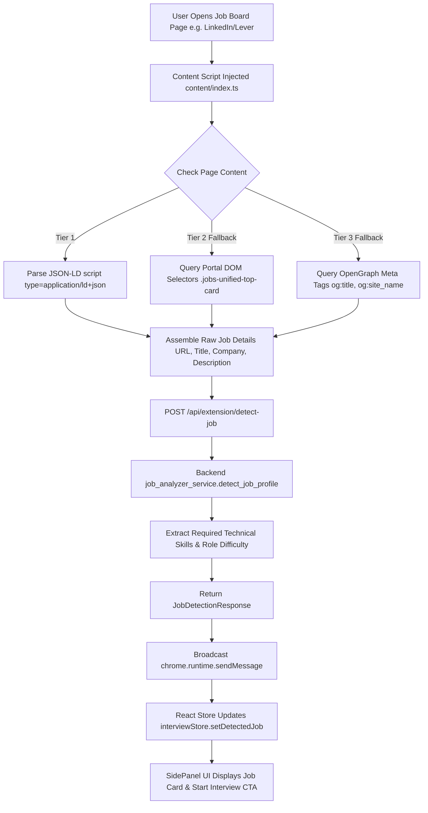
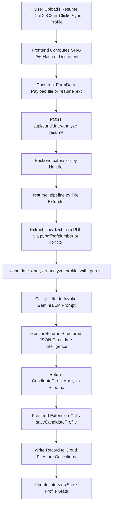
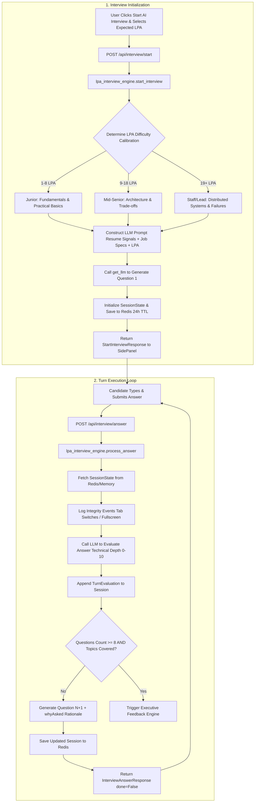
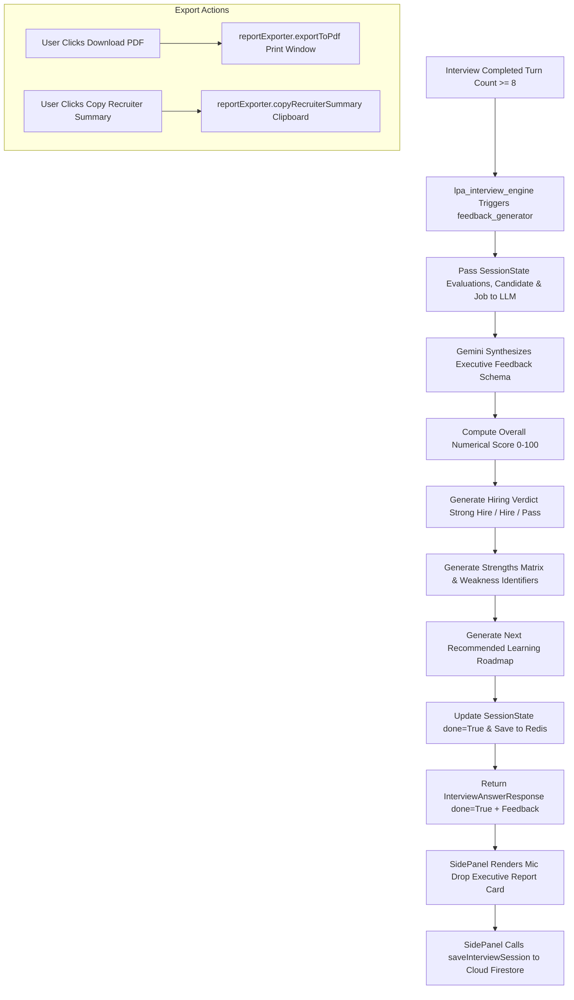
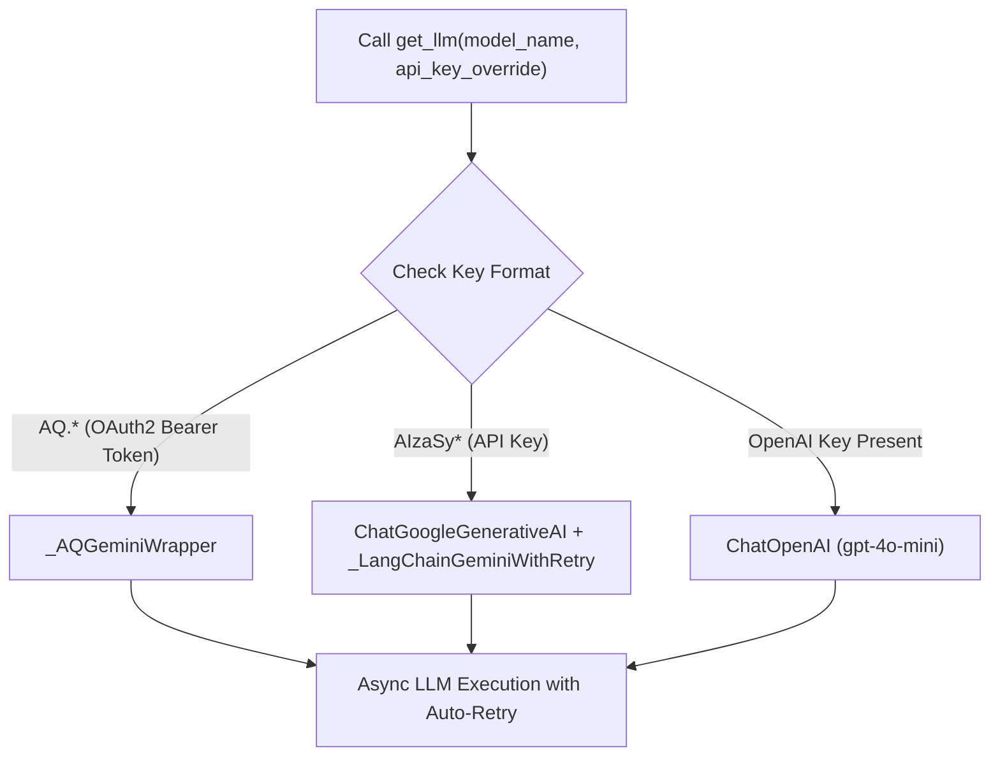

# 🚀 InterviewOS — Developer Architecture, API Flow & Onboarding Guide

Welcome to **InterviewOS**! This handbook is specifically crafted for developers joining the project. It provides an exhaustive breakdown of the platform's features, architecture (from DOM/API ingestion down to session storage and RAG retrieval), detailed execution flow charts, known code bugs/pitfalls, and key architectural suggestions for upcoming iterations.

---

## 📑 Table of Contents
1. [Project Overview & Core Mission](#1-project-overview--core-mission)
2. [Technology Stack](#2-technology-stack)
3. [Repository Directory Structure](#3-repository-directory-structure)
4. [Complete Feature Catalog](#4-complete-feature-catalog)
5. [Detailed Step-by-Step Execution Flows](#5-detailed-step-by-step-execution-flows)
6. [LLM Provider & Orchestration Tier](#6-llm-provider--orchestration-tier)
7. [Session Storage & Database Architecture](#7-session-storage--database-architecture)
8. [Known Bugs, Edge Cases & Code Errors](#8-known-bugs-edge-cases--code-errors)
9. [Architectural Suggestions & Feature Roadmap](#9-architectural-suggestions--feature-roadmap)

---

## 🎯 1. Project Overview & Core Mission

**InterviewOS** is an **Enterprise AI Technical Interview & Job Intelligence Copilot**. Built as a Manifest V3 Chrome Extension paired with a high-throughput Python FastAPI backend, it provides real-time job context scraping, adaptive technical interviewing, explainable AI rationales, and executive evaluation reporting.

---

## 🛠️ 2. Technology Stack

### Backend Stack (`/backend`)
- **Framework**: Python 3.13 + FastAPI + Pydantic v2 ([main.py](file:///d:/Ai%20Interview%20Ext/backend/app/main.py))
- **LLM Orchestration**: Dual Google Gemini 1.5/Flash engine (`langchain-google-genai` + custom OAuth2 Bearer `_AQGeminiWrapper`) with OpenAI (`gpt-4o-mini`) fallback via unified factory [`get_llm()`](file:///d:/Ai%20Interview%20Ext/backend/app/utils/llm.py#L166-L255).
- **RAG & Vector Search**: Qdrant (`:memory:` vector store) with JSON curriculum embeddings in [`CurriculumRetriever`](file:///d:/Ai%20Interview%20Ext/backend/app/rag/retriever.py#L6-L62).
- **Session Storage**: Dual-tier [`SessionService`](file:///d:/Ai%20Interview%20Ext/backend/app/services/session_service.py#L10-L75) (Async Redis via `redis.asyncio` with in-memory dict fallback).

---

## ⚡ 4. Complete Feature Catalog

1. **Automatic Job Context Extraction**: Uses 3-tier extraction in content scripts ([`content/index.ts`](file:///d:/Ai%20Interview%20Ext/frontend/src/content/index.ts)) — JSON-LD Schema.org, CSS selectors, OpenGraph meta.
2. **Resume & Profile AI Extraction**: PDF/DOCX resume text extraction via [`resume_pipeline.py`](file:///d:/Ai%20Interview%20Ext/backend/app/services/resume_pipeline.py) and Gemini profile parsing.
3. **Job Match & Readiness Scoring Card**: Mathematical compatibility scores calculated from skill overlap in [`scoring_engine.py`](file:///d:/Ai%20Interview%20Ext/backend/app/services/scoring_engine.py).
4. **LPA-Calibrated Technical Interview Engine**: Dynamically adapts interview question depth based on expected LPA ([`lpa_interview_engine.py`](file:///d:/Ai%20Interview%20Ext/backend/app/services/lpa_interview_engine.py)).
5. **Proctoring & Integrity Logging**: Monitors tab visibility changes, fullscreen exits, and device availability via `/api/interview/integrity`.
6. **Executive Report Card & Export Engine**: Custom PDF report export and one-click recruiter summary clipboard copying.

---

## 🔄 5. Detailed Step-by-Step Execution Flows

### 📍 Flow 1: Real-Time Job Posting Scraping & Detection Flow

#### Step-by-Step Execution:
1. **Page Load**: Candidate navigates to a job posting on a supported domain (LinkedIn, Greenhouse, Lever, Workday, Indeed).
2. **Content Script Scraping**: `content/index.ts` runs automatically. It attempts Tier 1 extraction (`JSON-LD` Schema.org `JobPosting`), falls back to Tier 2 (DOM CSS selectors), and Tier 3 (OpenGraph meta tags).
3. **Backend Detection Request**: Calls `POST /api/extension/detect-job` with raw page text and metadata.
4. **Analysis Service**: `job_analyzer_service.detect_job_profile()` identifies whether the page represents a valid job posting, extracts target skills, company, and role summary.
5. **UI Rendering**: SidePanel updates reactively via `interviewStore`, displaying target job details, match badges, and the "Start AI Technical Interview" CTA button.

---

### 📍 Flow 2: Resume Upload & Profile AI Extraction Flow

---

### 📍 Flow 3: Dynamic LPA-Calibrated Technical Interview Turn Flow

#### Step-by-Step Execution:
1. **Start Request**: Candidate selects expected salary target (e.g. ₹14 LPA) and triggers `POST /api/interview/start`.
2. **LPA Difficulty Calibration**: `lpa_interview_engine.py` categorizes difficulty:
   - **$\le 8$ LPA**: Core programming fundamentals and practical coding basics.
   - **$9 - 18$ LPA**: System architecture, trade-offs, debugging, and DB design.
   - **$\ge 19$ LPA**: High-throughput scalability, distributed system failure modes, and lead trade-offs.
3. **Question 1 Generation**: Gemini generates Question 1 grounded in the candidate's actual projects and the job posting requirements.
4. **Session Persistence**: Session stored in Redis (`interview_session:{sessionId}`) with a 24-hour expiration.
5. **Turn Evaluation Loop (`/interview/answer`)**:
   - Candidate submits answer text.
   - Evaluated on a 0–10 score scale by Gemini LLM, recording specific technical strengths and identified gaps.
   - Checks turn count: If questions $< 8$, generates Question $N+1$ with `whyAsked` explainability notes. If questions $\ge 8$, transitions to final evaluation.

---

### 📍 Flow 4: Executive Evaluation & Outcome Reporting Flow

---

## 🤖 6. LLM Provider & Orchestration Tier

Located in [`app/utils/llm.py`](file:///d:/Ai%20Interview%20Ext/backend/app/utils/llm.py), the `get_llm()` factory provides unified access to LLM providers:

---

## 💾 7. Session Storage & Database Architecture

### 7.1 Backend Dual-Tier Storage Layer (`SessionService`)
- **Primary Redis Storage**: Connects using `redis.asyncio` via `REDIS_URL`. Serializes `SessionState` to JSON with 24-hour expiration (`setex(f"interview_session:{id}", 86400, json)`).
- **In-Memory Storage Fallback**: An in-memory dict `self._memory_sessions` acts as an automatic fail-safe fallback if Redis is offline.

### 7.2 Frontend Cloud Persistence (`firestore.ts`)
- Persists candidate profiles, job matches, and completed interview transcripts directly to Cloud Firestore:
  - `users/{userId}/candidateProfiles/{profileId}`
  - `users/{userId}/jobMatches/{matchId}`
  - `users/{userId}/interviewSessions/{sessionId}`
  - `candidates/{candidateId}`

---

## ⚠️ 8. Known Bugs, Edge Cases & Code Errors

> [!WARNING]
> ### 1. Process Isolation in In-Memory Session Fallback
> - **Location**: [`app/services/session_service.py#L16`](file:///d:/Ai%20Interview%20Ext/backend/app/services/session_service.py#L16)
> - **Issue**: If Redis is offline and Uvicorn runs with `--workers 4`, in-memory session dicts are process-isolated.

---

## 🚀 9. Architectural Suggestions & Feature Roadmap

### High Priority
1. **Persistent Relational Database (SQLModel / PostgreSQL)**
2. **Unified Auth Layer (JWT / OAuth2)**

---
*Guide prepared for InterviewOS engineering team.*
